# Predicting Amazon Best Sellers
### A Predictive Modeling Study on 1.4 Million Product Listings

**Course:** STA 6933 — Advanced Topics in Statistical Learning | The University of Texas at San Antonio, Spring 2026 
**Contributors:** Dulce Ximena Cid Sanabria & Marco Alejandro Ortiz  

---

## The Question

Amazon's Best Seller badge is one of the most valuable signals on the platform — it drives placement, click-through, and conversion. But what actually predicts whether a product earns it?

This project builds and evaluates **five statistical and machine learning models** to answer that question using 1.4 million Amazon product listings across 248 categories. The challenge: Best Seller status is **rare** — only 0.67% of products carry it. That rarity forces a shift in how we think about success. The goal is not to classify products with a hard threshold, but to **rank** them by their probability of being a Best Seller so that a curator with a limited review budget can efficiently surface the most promising listings.

---

## The Data

The dataset contains **1,426,337 raw product listings** paired with a categories lookup table. Three columns with no predictive value (`imgUrl`, `productURL`, `listPrice`) are dropped. Listings with `price = 0` or `stars = 0` — corresponding to free/promotional or unrated products — are also removed.

After cleaning, **1,267,186 rows remain** — 89% of the original data.

| Metric | Value |
|---|---|
| Raw rows | 1,426,337 |
| After `price > 0` & `stars > 0` | 1,267,186 |
| Best Seller prevalence | 0.67% |
| Missing values (post-clean) | 0 |

Because `price` and `reviews` are heavily right-skewed, both are log-transformed before modeling: `log_price = log(price)` and `log_reviews = log1p(reviews)`. The `log1p` transformation handles the large mass of zero-review products without dropping them.

### Descriptive Statistics

| Variable | Min | Median | Mean | Max | SD |
|---|---|---|---|---|---|
| Price (USD) | 0.01 | 19.99 | 41.18 | 11,998 | 100.39 |
| Stars (1–5) | 1.00 | 4.50 | 4.40 | 5.00 | 0.46 |
| Review count | 0 | 0 | 197.50 | 346,563 | 1,826.65 |

The median review count is **zero** — more than half of all listings have never been reviewed. The median price is $19.99 and the star distribution peaks near 4.5, reflecting the well-known voluntary rating bias on e-commerce platforms.

---

## Exploratory Data Analysis

### 1. The Class Imbalance Problem

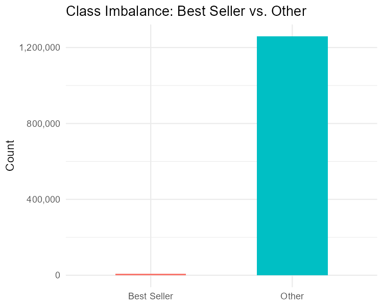

The scale of the imbalance is stark: roughly **1.26 million non-Best-Sellers** versus about **8,500 Best Sellers**. A naive model that always predicts "not a Best Seller" achieves **99.33% accuracy with zero useful recall**. This is why accuracy is abandoned entirely as an evaluation metric in favor of PR-AUC and operating-point lift.

To counteract this imbalance during training, **inverse-prevalence sample weights** are applied: each positive observation is weighted by `1 / 0.0067 ≈ 149` and each negative by `1 / 0.9933 ≈ 1.007`, so the loss function treats the minority class proportionally.

---

### 2. Why Log-Transform Price and Reviews?

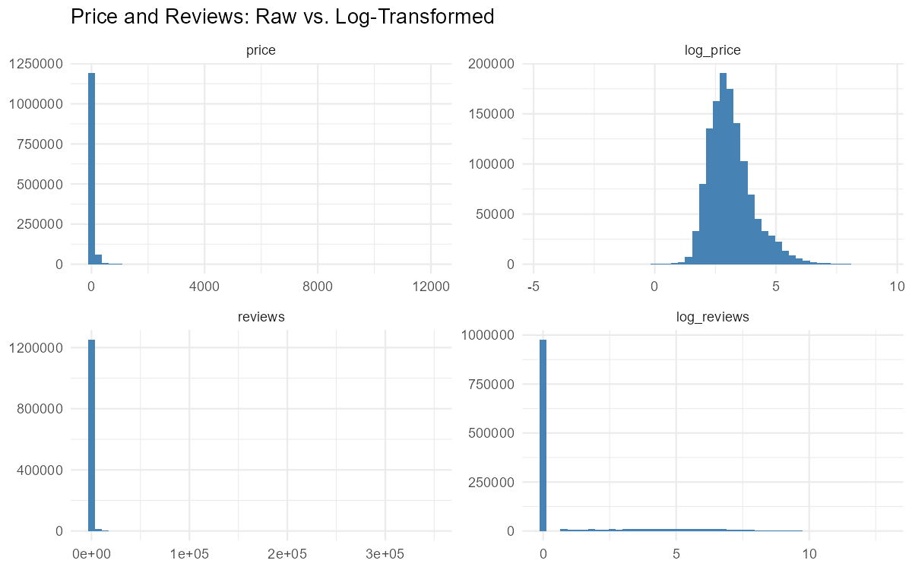

The raw distributions of `price` and `reviews` are extremely right-skewed — the median price is under $20 but the max is nearly $12,000, and the median review count is zero while the max is 346,563. After log-transformation, both predictors become **approximately symmetric**, making them far more suitable for regression-based models. `log_reviews` retains a visible spike at zero from unreviewed products, which is a real feature of the data rather than an artifact.

---

### 3. Distributions of log(price) and Stars

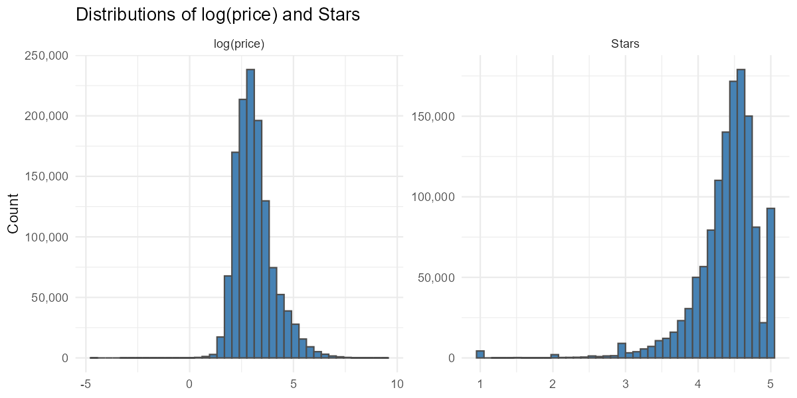

`log(price)` is roughly symmetric around the mid-range — a well-behaved continuous predictor. `stars`, however, tells a different story: the distribution is **heavily left-skewed**, with a massive concentration near 4.5 and a long lower tail. This reflects selection bias in voluntary rating systems — customers who bother to rate tend to rate highly, and products with very low ratings get delisted. Because of this shape, `stars` enters the GAM as a **linear term** rather than a smooth.

---

### 4. Which Categories Have the Highest Best Seller Density?

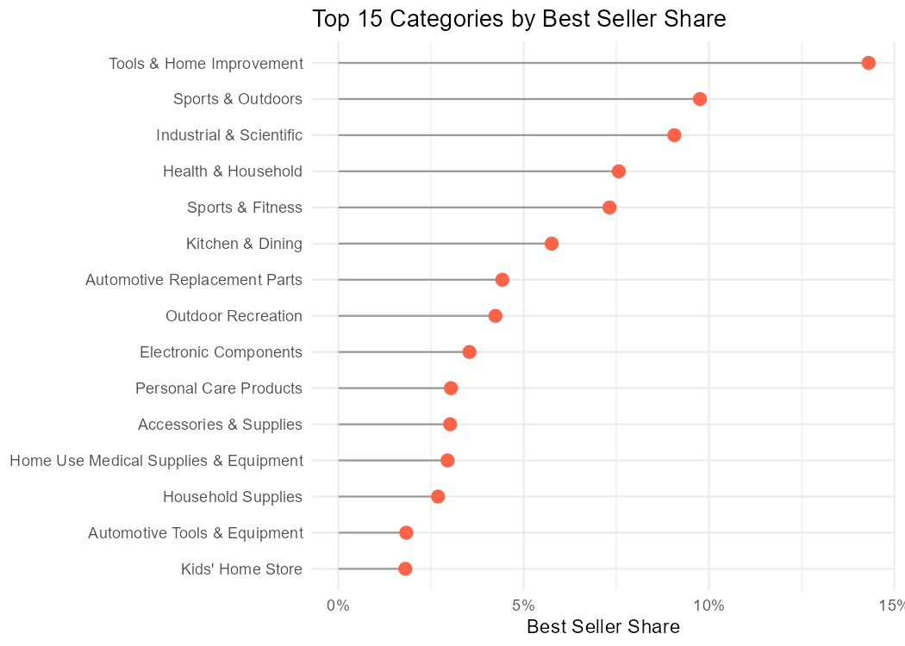

Best Seller density varies **by an order of magnitude** across categories. **Tools & Home Improvement** leads at over 15%, followed by Sports & Outdoors and Industrial & Scientific. These categories tend to have highly functional, commodity-like products where quality signals (high reviews, good ratings) translate directly into Best Seller status.

This variation is the core reason category is included as a high-dimensional fixed effect rather than discarded. A model blind to category would systematically misrank products.

---

### 5. Do Star Ratings Separate Best Sellers from the Rest?

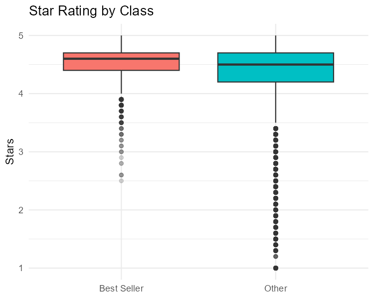

Best Sellers do cluster near the top of the rating scale — their interquartile range sits between roughly 4.4 and 5.0. But the **distributional overlap with non-Best Sellers is large**: the "Other" class has essentially the same median and a similar IQR. Stars alone separate the classes only weakly. This motivates including multiple predictors rather than relying on any single feature.

---

### 6. Unconditional Star Rating Distribution

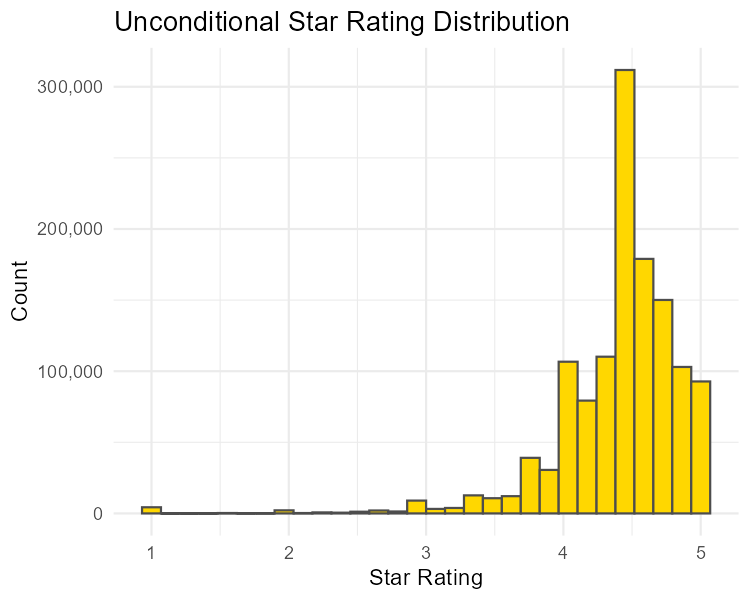

The unconditional distribution confirms the skew: over 300,000 products are rated between 4.5 and 5.0. The distribution is clearly non-Gaussian — a linear model assuming normally distributed `stars` would be misspecified. This is why `stars` is treated as a continuous covariate rather than a target of inferential interest, and why the GAM uses a logit link rather than a Gaussian working model.

---

### 7. Which Categories Have the Most Products?

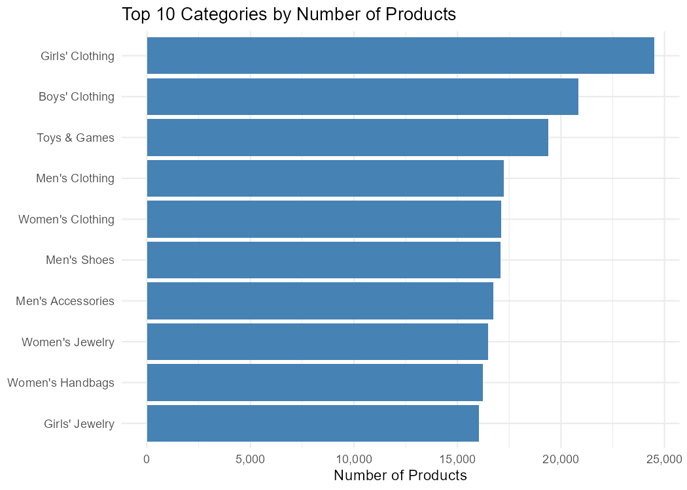

The most populated categories are dominated by apparel: **Girls' Clothing, Boys' Clothing, and Toys & Games** together account for about 5% of the analytic sample. Crucially, these are **not** the same categories with the highest Best Seller density — the most populated categories have relatively low Best Seller rates. This divergence means category effects in the Lasso must be interpreted relative to a non-uniform baseline mix rather than a single dominant reference group.

---

### 8. PCA on Numeric Predictors

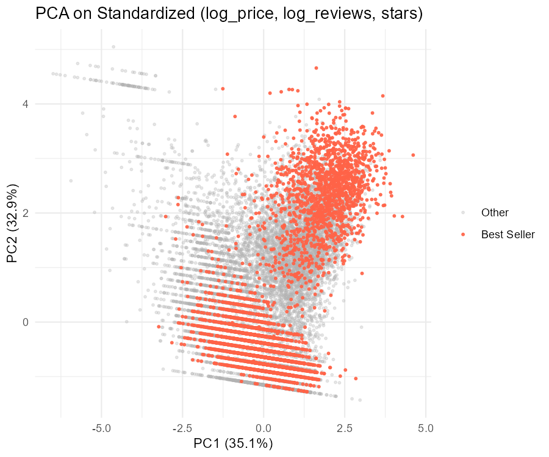

A two-component PCA on standardized `(log_price, log_reviews, stars)` reveals that the first two principal components explain **35.1% and 32.9%** of the variance respectively — together capturing about 68% of the numeric signal. However, the Best Seller cloud (red) **overlaps heavily** with the non-Best Seller cloud (grey) in PC space. The positive class is not linearly separable in the numeric subspace alone. This confirms that the categorical structure — which category a product belongs to — carries discriminative information that the numeric block cannot provide on its own.

---

## Methodology

Five models are fit and compared. The design choices reflect the structure of the problem: rare events, a high-cardinality categorical predictor, and potential non-linearity in the continuous predictors.

| Model | Key Design Choice |
|---|---|
| **Lasso (small)** | L1-penalized logistic regression, 248 fine-grained category dummies |
| **Lasso (big)** | L1-penalized logistic regression, 18 coarse category groups |
| **GAM** | Penalized splines on `log(reviews)` and `log(price)`, coarse categories |
| **Multilevel Logistic** | Random intercept per fine-grained category, fixed effects on coarse groups |
| **SVM (RBF)** | Gaussian kernel, numeric block + coarse categories, Platt-scaled probabilities |

The train/test split is **70/30 stratified by class** to preserve the 0.67% prevalence in both folds.

---

## Model Results

### Model 1a: Logistic Lasso — Fine-Grained Category (248 categories)

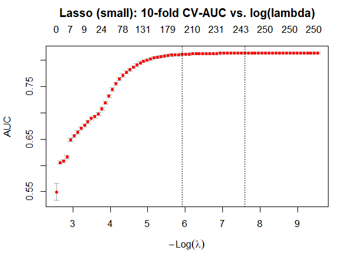

The 10-fold cross-validation curve plateaus around `lambda.min`, where **249 of the 250+ features** have non-zero coefficients. The L1 penalty shrinks small coefficients but does not produce true sparsity at this scale — every category provides some signal.

**Top 10 non-zero coefficients by absolute magnitude:**

| Term | Coefficient |
|---|---|
| category_name: Nintendo Switch Consoles | −4.441 |
| category_name: Building Toys | −3.927 |
| category_name: Online Video Game Services | +3.805 |
| category_name: Kids' Play Cars & Race Cars | −3.796 |
| category_name: Laptop Bags | −3.756 |
| category_name: Headphones & Earbuds | −3.729 |
| category_name: GPS & Navigation | −3.715 |
| category_name: Tools & Home Improvement | +3.704 |
| category_name: Women's Watches | −3.686 |
| category_name: Light Bulbs | −3.668 |

The category effects dominate the top of the coefficient list. Among the continuous predictors (not shown in top 10), `stars` is the largest in absolute magnitude, `log_reviews` second, and `log_price` smallest and **negative** — lower-priced products are more likely to become Best Sellers.

---

### Model 1b: Logistic Lasso — Coarse Category (18 big_category groups)

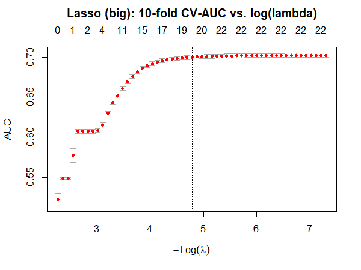

With only 18 group dummies, the L1 penalty does very little — almost every group enters with a non-zero estimate because each coefficient is identified by tens of thousands of observations. This model serves as the **linear-additive baseline** for the multilevel logistic.

**All non-zero coefficients:**

| Term | Coefficient |
|---|---|
| Sports & Outdoor | +2.600 |
| Wearable & VR | −2.332 |
| Office & Party | −1.613 |
| Luggage & Travel | −1.598 |
| Automotive | +1.043 |
| Smart Home | +1.024 |
| stars | +0.954 |
| Health & Wellness | +0.673 |
| Arts & Crafts | −0.644 |
| Household Supplies | +0.567 |
| Tools & Home Improvement | +0.545 |
| Video Games | −0.535 |
| Industrial & Scientific | +0.491 |
| Toys & Games | −0.462 |
| Electronics | −0.356 |
| Baby & Maternity | −0.226 |
| Home & Kitchen | +0.224 |
| Apparel & Accessories | −0.221 |
| log_price | −0.167 |
| Other | +0.157 |
| Beauty & Personal Care | −0.149 |
| log_reviews | +0.088 |

Sports & Outdoor has the single largest positive effect; Wearable & VR the largest negative. Stars remains positive and log_price negative, consistent with the fine-grained model.

---

### Model 2: Generalized Additive Model

The GAM uses penalized regression splines on `log(reviews)` and `log(price)`, a linear term for `stars`, and parametric fixed effects for the 18 coarse categories.

**GAM Summary (selected output):**

| Term | Estimate | Std. Error | z value | p-value |
|---|---|---|---|---|
| (Intercept) | −4.507 | 0.025 | −180.74 | < 2e-16 |
| stars | +0.881 | 0.006 | +160.24 | < 2e-16 |
| Sports & Outdoor | +2.693 | 0.012 | +224.56 | < 2e-16 |
| Automotive | +1.291 | 0.009 | +143.96 | < 2e-16 |
| Smart Home | +1.169 | 0.038 | +31.11 | < 2e-16 |
| Health & Wellness | +0.801 | 0.009 | +86.14 | < 2e-16 |
| Luggage & Travel | −1.559 | 0.018 | −86.56 | < 2e-16 |
| Wearable & VR | −1.876 | 0.051 | −36.84 | < 2e-16 |

**Adjusted R²:** 0.0888 · **Deviance explained:** 16.7% · **n:** 887,030

**Smooth terms:**

| Smooth | EDF | Ref. df | p-value |
|---|---|---|---|
| s(log_reviews) | 8.940 | 8.998 | < 2e-16 |
| s(log_price) | 8.906 | 8.993 | < 2e-16 |

Both smooths have **EDF well above 1**, confirming genuine non-linearity. An EDF near 1 would indicate a linear relationship; values near 9 indicate complex curvature that a simple linear term would miss entirely.

**GAM Partial Effects:**

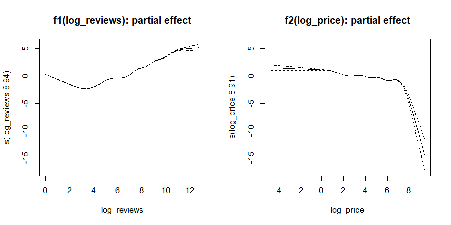

This is one of the most interpretable outputs of the entire study. The left panel shows `f₁(log_reviews)`: the curve **rises steeply at low review counts** and **flattens as volume grows**. This is the classic diminishing-returns pattern — going from 0 to 10 reviews matters far more than going from 1,000 to 1,010. The right panel shows `f₂(log_price)`: an approximately **monotone-decreasing** relationship — lower-priced products are more likely to reach Best Seller status, all else equal.

---

### Model 3: Multilevel (Hierarchical) Logistic Regression

The multilevel model nests fine-grained categories within coarse parent groups, letting small categories **shrink toward their parent group mean** rather than being estimated independently.

**Model Structure Summary:**

| Metric | Value |
|---|---|
| Fixed effects (rows) | 23 |
| big_category levels | 20 |
| category_name (random) variance | 2.0588 |
| category_name (random) SD | 1.4348 |

The random intercept SD of **1.43 on the log-odds scale** is substantial — this means categories vary considerably in their baseline Best Seller rates even after accounting for the coarse parent group fixed effects.

**Fixed Effect Estimates (top rows):**

| Term | Estimate | Std. Error | p-value |
|---|---|---|---|
| (Intercept) | −5.93 | 0.352 | 0.000 |
| log_price | −0.108 | 0.020 | 0.000 |
| log_reviews | +0.356 | 0.012 | 0.000 |
| stars | +0.721 | 0.055 | 0.000 |
| Electronics | −1.040 | 0.397 | 0.009 |

The continuous predictors carry the **same signs as the Lasso** — a useful consistency check. Price is negative, reviews and stars are positive. Most big-category fixed effects are **not individually significant** (p > 0.05) after the random intercept absorbs the within-group variation, which is expected behavior in a well-specified mixed model.

---

### Model 4: Support Vector Machine — RBF Kernel

The SVM is fit on a **stratified subsample** (all positives + 5:1 negatives) because the kernel matrix scales quadratically with training size.

**SVM Training Summary:**

| Metric | Value |
|---|---|
| Subsample size | 35,406 |
| Subsample BS prevalence | 16.67% |
| Support vectors | 23,520 |
| Numeric features | 3 |
| big_category dummies | 19 |

**23,520 support vectors out of 35,406 training observations** — about 66% — indicates a **highly complex decision boundary** in the kernel feature space. This is expected given the class overlap shown in the PCA. Despite this complexity, the SVM does not meaningfully outperform the additive GAM, suggesting that non-linear *interactions* between the numeric features are small — the additive structure captures most of the signal.

---

## Evaluation

### ROC and Precision-Recall Curves

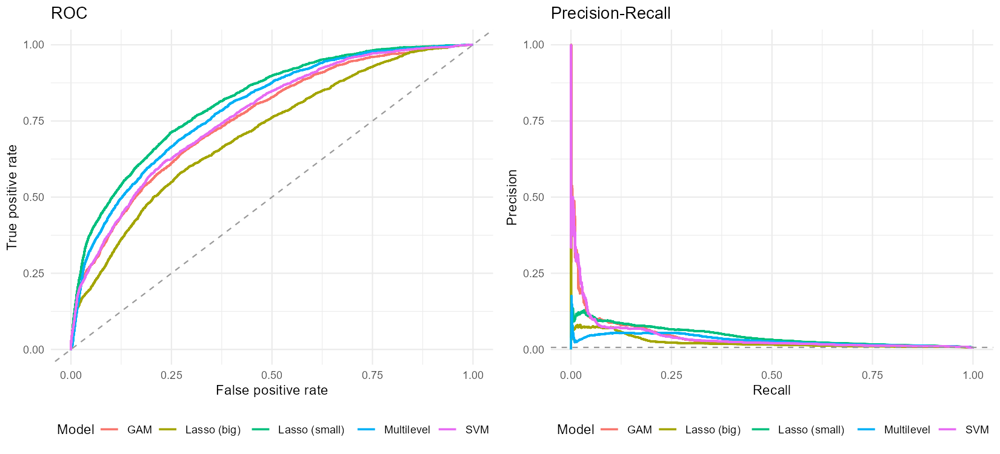

**Left panel (ROC):** All five models separate clearly from the diagonal, with the Lasso (small) curve sitting consistently highest. ROC-AUC measures the probability that a randomly chosen Best Seller is ranked above a randomly chosen non-Best Seller.

**Right panel (Precision-Recall):** The dashed horizontal line marks the **0.67% test prevalence baseline** — what a random ranker would achieve. All five models dominate this baseline, especially in the low-recall regime (top of the ranked list) where operational decisions are made. The pink spike near Recall = 0 for the Lasso (small) reflects extremely high precision when predicting the very top-ranked products.

### AUC Summary Table

| Model | ROC-AUC | PR-AUC |
|---|---|---|
| **Lasso (small)** | **0.8134** | **0.0435** |
| Multilevel | 0.7905 | 0.0298 |
| SVM (RBF) | 0.7663 | 0.0397 |
| GAM | 0.7577 | 0.0407 |
| Lasso (big) | 0.7072 | 0.0235 |

PR-AUC is the primary metric. The Lasso (small) leads on both PR-AUC and ROC-AUC. The GAM trails slightly in PR-AUC despite its richer functional form, because it uses the coarser 18-category grouping rather than the full 248 categories.

### Probability Calibration Check

A healthy model assigns **higher predicted probabilities to true positives** than to true negatives. The table below confirms this for all five models:

| Model | Class | Median p̂ | 95th Percentile p̂ |
|---|---|---|---|
| Lasso (small) | Negatives | 0.334 | 0.748 |
| Lasso (small) | **Positives** | **0.646** | **0.947** |
| Lasso (big) | Negatives | 0.431 | 0.691 |
| Lasso (big) | **Positives** | **0.567** | **0.919** |
| GAM | Negatives | 0.405 | 0.703 |
| GAM | **Positives** | **0.591** | **0.935** |
| Multilevel | Negatives | 0.081 | 0.356 |
| Multilevel | **Positives** | **0.243** | **0.659** |
| SVM | Negatives | 0.085 | 0.357 |
| SVM | **Positives** | **0.325** | **0.517** |

The Lasso (small) shows the **cleanest separation**: the median for positives (0.646) is nearly twice that of negatives (0.334). No model collapses to a degenerate constant — the inverse-prevalence weighting achieves its purpose.

---

## Operating-Point Metrics: What a Curator Actually Sees

At 0.67% prevalence, the most practical question is: **if you can only review the top K% of products, how many Best Sellers do you capture, and how often are you right?**

| Model | Top K | Precision | Recall | Specificity | Lift |
|---|---|---|---|---|---|
| **Lasso (small)** | **0.5%** | **0.0956** | **0.0720** | 0.9954 | **14.4×** |
| GAM | 0.5% | 0.0978 | 0.0735 | 0.9955 | 14.7× |
| SVM (RBF) | 0.5% | 0.0857 | 0.0645 | 0.9954 | 12.9× |
| Multilevel | 0.5% | 0.0326 | 0.0245 | 0.9951 | 4.9× |
| Lasso (big) | 0.5% | 0.0745 | 0.0561 | 0.9953 | 11.2× |
| **Lasso (small)** | **1.0%** | **0.0857** | **0.1289** | 0.9908 | **12.9×** |
| GAM | 1.0% | 0.0815 | 0.1226 | 0.9908 | 12.3× |
| SVM (RBF) | 1.0% | 0.0705 | 0.1060 | 0.9906 | 10.6× |
| Multilevel | 1.0% | 0.0499 | 0.0751 | 0.9904 | 7.5× |
| Lasso (big) | 1.0% | 0.0710 | 0.1068 | 0.9906 | 10.7× |
| **Lasso (small)** | **5.0%** | **0.0505** | **0.3792** | 0.9522 | **7.6×** |
| GAM | 5.0% | 0.0364 | 0.2736 | 0.9515 | 5.5× |
| Multilevel | 5.0% | 0.0432 | 0.3250 | 0.9518 | 6.5× |
| SVM (RBF) | 5.0% | 0.0366 | 0.2748 | 0.9515 | 5.5× |
| Lasso (big) | 5.0% | 0.0266 | 0.2001 | 0.9510 | 4.0× |
| **Lasso (small)** | **10.0%** | **0.0325** | **0.4887** | 0.9026 | **4.9×** |
| Multilevel | 10.0% | 0.0295 | 0.4433 | 0.9023 | 4.4× |
| GAM | 10.0% | 0.0255 | 0.3828 | 0.9019 | 3.8× |
| SVM (RBF) | 10.0% | 0.0255 | 0.3839 | 0.9019 | 3.8× |
| Lasso (big) | 10.0% | 0.0204 | 0.3060 | 0.9014 | 3.1× |

**Reading the top-1% row for Lasso (small):** If a buyer reviews the top 1% of ranked products (~12,700 listings), they will find Best Sellers at **12.9× the rate of random browsing**, capturing nearly **13% of all Best Sellers in the catalog** in that single 1% slice.

---

## Model Comparison Summary

| Criterion | Value |
|---|---|
| PR-AUC winner | **Lasso (small)** |
| PR-AUC runner-up | GAM |
| PR-AUC margin (1st − 2nd) | 0.0028 |
| ROC-AUC winner | **Lasso (small)** |
| ROC-AUC margin (1st − 2nd) | 0.0229 |
| Test-set prevalence (PR-AUC baseline) | 0.0067 |
| **PR-AUC lift over baseline** | **6.5×** |
| **Recommended model** | **Lasso (small)** |

---

## Key Findings

**1. Reputation beats price.** Star rating carries the largest coefficient among continuous predictors in every linear model. Log-reviews is second. Log-price is negative and small — cheaper products are slightly more likely to become Best Sellers, but the effect is modest compared to reputation signals.

**2. Non-linearity in reviews is real.** The GAM's smooth `f₁(log_reviews)` has an effective degrees of freedom of **8.94** — far from linear. The diminishing-returns curve is statistically unambiguous (p < 2e-16). A linear model systematically underestimates the importance of the first few reviews and overestimates the value of accumulating reviews once a product is already highly reviewed.

**3. Fine-grained category resolution matters.** Collapsing 248 categories to 18 groups drops PR-AUC from 0.0435 to 0.0235 — nearly half the signal. The within-group variation captured by individual category dummies is not recoverable through partial pooling alone.

**4. The multilevel model loses to the fine-grained Lasso.** With only ~10 random levels per parent group and 0.67% prevalence, the random intercepts shrink too aggressively toward their parent means, washing out within-group heterogeneity that the unpenalized one-hot encoding preserves.

**5. Non-linear numeric interactions are small.** The RBF SVM, which can capture arbitrary interactions between `log_price`, `log_reviews`, and `stars`, does not improve meaningfully over the additive GAM. The additive structure is a good approximation of the true signal in the numeric block.

---

## R Libraries

The project uses 12 R packages across four functional categories. **No deep learning frameworks are used** — all five models are classical statistical or kernel-based methods, which is the appropriate choice for tabular data at this scale.

### 🤖 Machine Learning

| Package | Role |
|---|---|
| **glmnet** | Fits both Logistic Lasso models via coordinate descent with 10-fold CV. Handles the sparse 248-category one-hot matrix efficiently. The core ML workhorse. |
| **e1071** | Fits the RBF SVM via `svm()`, wrapping LIBSVM. Provides Platt-scaled probability outputs for rare-event ranking. |
| **mgcv** | Fits the GAM with penalized regression splines. Uses REML to automatically select smoothing penalties. Sits at the boundary of statistical modeling and ML. |
| **pROC** | Computes ROC curves and AUC on the held-out test set for all five models. |
| **PRROC** | Computes Precision-Recall curves and PR-AUC — the primary evaluation metric under extreme class imbalance. |

### 📐 Statistical Modeling

| Package | Role |
|---|---|
| **lme4** | Fits the Multilevel Logistic Regression via `glmer()` with a BOBYQA optimizer. Estimates fixed effects on 18 coarse groups and random intercepts on 248 fine-grained categories. |
| **broom.mixed** | Tidies `glmer` output into clean data frames of fixed-effect estimates, standard errors, and p-values. |
| **Matrix** | Provides sparse matrix support via `sparse.model.matrix()` for the 248-category one-hot design matrix. Without sparsity, storing the full dense matrix for 1.2M rows × 250 columns would require ~2.4 GB of RAM. |

### 🔧 Data Wrangling & Utilities

| Package | Role |
|---|---|
| **tidyverse** | Covers `dplyr` (data manipulation), `tidyr` (reshaping), `readr` (CSV import), `purrr` (functional iteration in the top-K metrics function), and `ggplot2` (all visualizations). |
| **scales** | Formats axis labels as percentages and comma-separated numbers in plots and summary tables. |
| **knitr** | Powers the R Markdown rendering pipeline — executes each code chunk and weaves output into the PDF. |
| **gridExtra** | Arranges multiple `ggplot2` panels side-by-side (e.g., the ROC and PR curves displayed together). |

### Why No Deep Learning?

Deep learning frameworks (`keras`, `torch`, `tensorflow`) are not used here, and deliberately so. With tabular data, 3 numeric features, and 1 high-cardinality categorical predictor, classical methods are **better suited**:

- The **Lasso** provides interpretable, sparse coefficients with formal regularization theory.
- The **GAM** recovers non-linear shapes with formal uncertainty bands and EDF-based tests.
- The **multilevel logistic** handles hierarchical structure through partial pooling with interpretable variance components.
- The **RBF SVM** tests for non-linear numeric interactions without requiring a neural architecture.

The results validate this choice: the SVM (which approximates what a shallow neural network might do) does not outperform the additive GAM, confirming that non-linear interactions in the numeric block are small.

---

## Repository Structure

```
amazon-bestseller-prediction/
├── data/
│   ├── amazon_products.csv         # 1.4M product listings (see note below)
│   └── amazon_categories.csv       # Category ID lookup table
├── figures/
│   ├── class_imbalance.png
│   ├── log_transform_distributions.png
│   ├── log_price_stars_dist.png
│   ├── category_bestseller_share.png
│   ├── star_rating_by_class.png
│   ├── star_rating_unconditional.png
│   ├── top10_categories_count.png
│   ├── pca_numeric.png
│   ├── lasso_small_cv.png
│   ├── lasso_big_cv.png
│   ├── gam_partial_effects.png
│   └── roc_pr_curves.png
├── report/
│   ├── milestone4_v3.Rmd           # Full analysis in R Markdown
│   └── milestone4_v3.pdf           # Knitted PDF report
└── README.md
```

> **Data note:** `amazon_products.csv` may exceed GitHub's 100 MB file size limit.

---

## Reproducing the Analysis

**Requirements:** R ≥ 4.2 with the following packages:

```r
install.packages(c(
  "tidyverse", "glmnet", "mgcv", "pROC", "PRROC",
  "Matrix", "scales", "knitr", "gridExtra",
  "e1071", "lme4", "broom.mixed"
))
```

> **Runtime note:** The full pipeline — especially the fine-grained Lasso (10-fold CV on 887K rows) and the GAM — takes approximately **30–60 minutes** depending on hardware.

---

## Tech Stack

`R` · `tidyverse` · `glmnet` · `mgcv` · `lme4` · `e1071` · `pROC` · `PRROC` · `Matrix` · `broom.mixed` · `scales` · `gridExtra`
